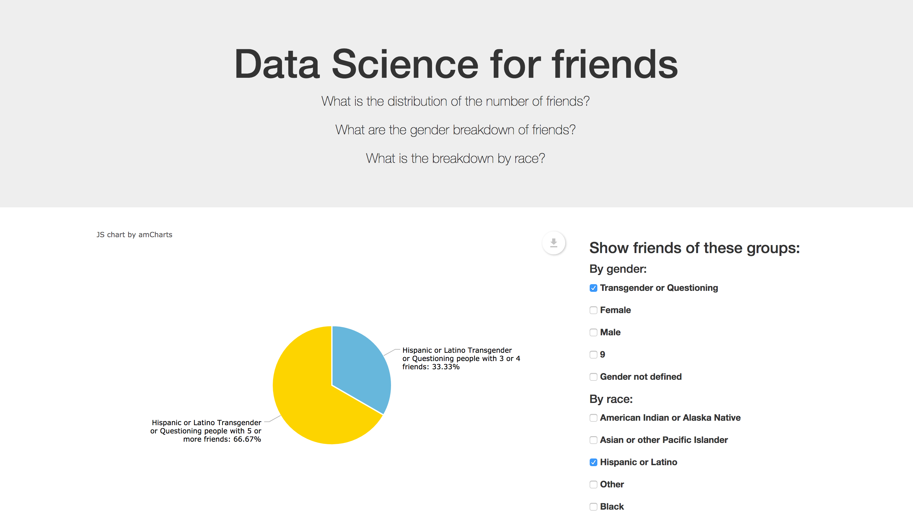
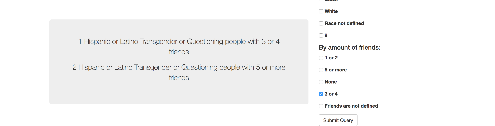
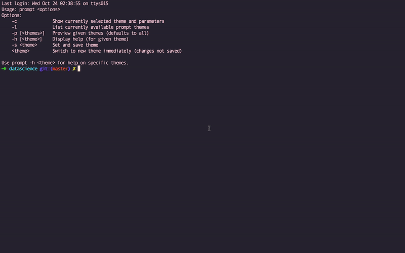
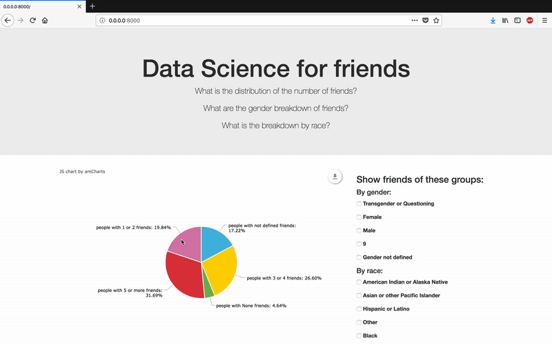
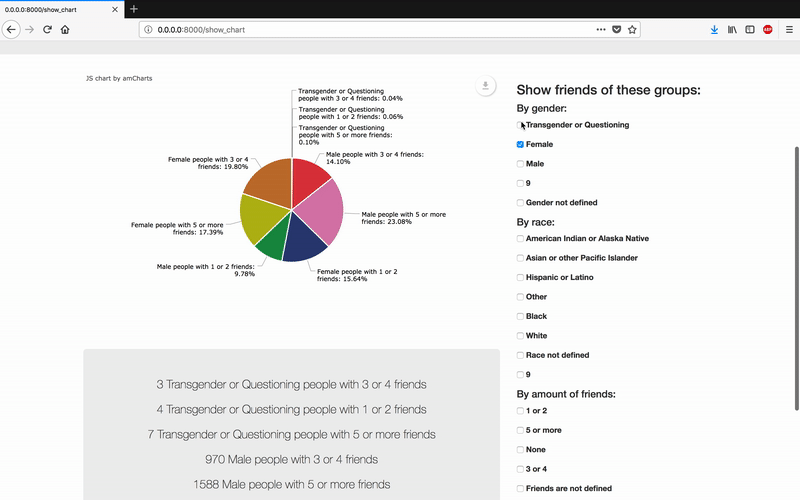
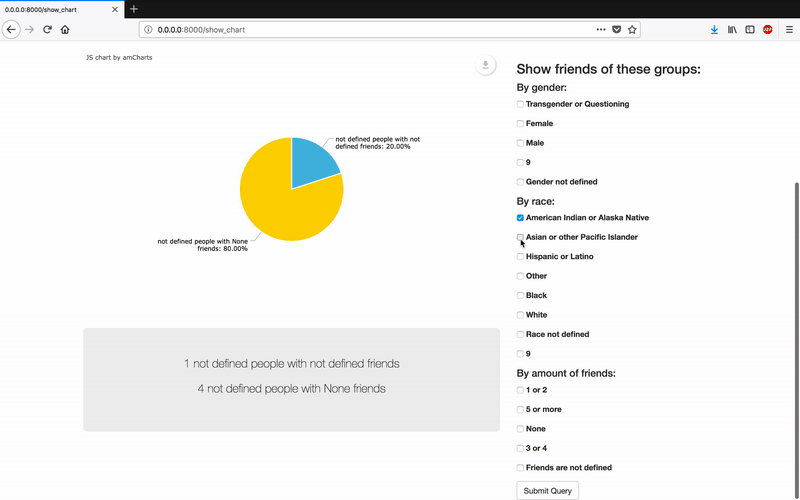
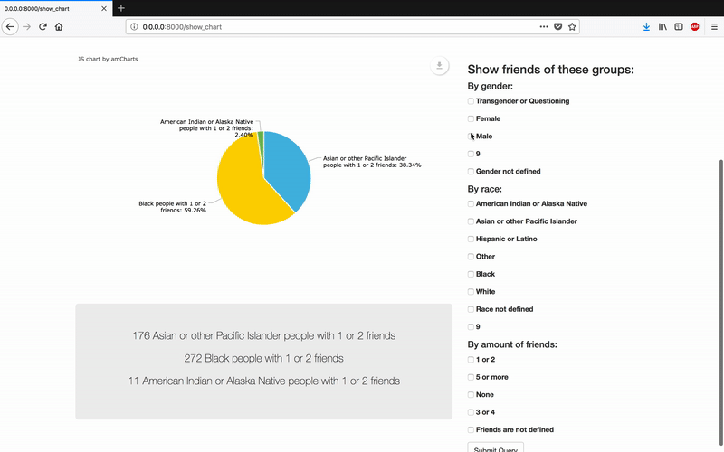
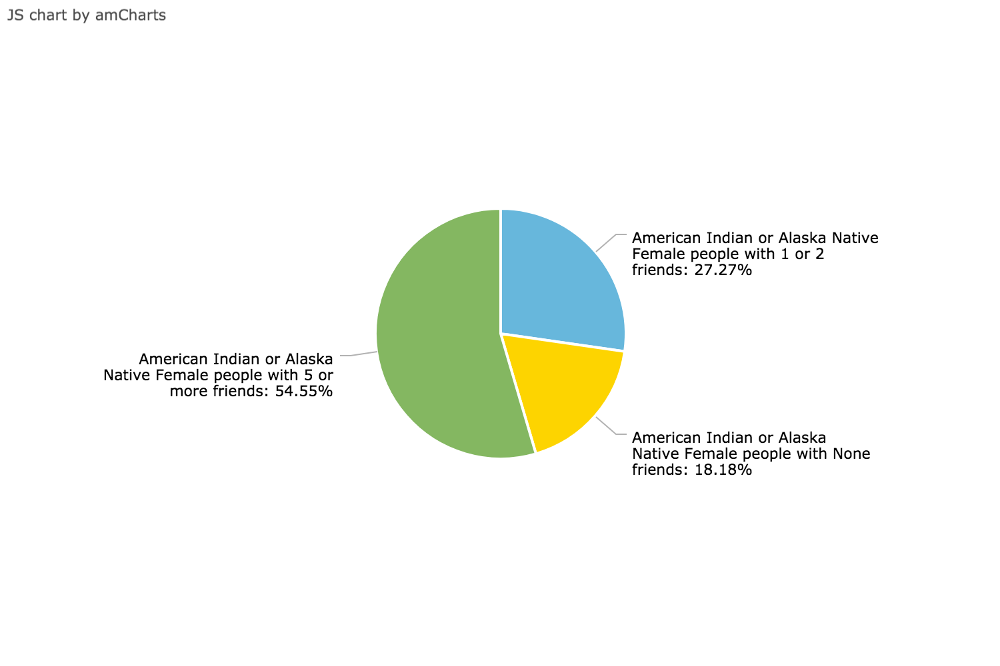

# outreachy-datascience
 School-YRBS: Friends. Issue 11 solution by madinab


## Task Instructions

The administration wants to better understand the social dynamic of the high school. The dataset contains a relevant column called friends, which is the number of friends of the student.

What is the distribution of the number of friends?

What are the gender breakdown of friends?

What is the breakdown by race?


## Proposed solution

Python script for dynamic data retrieval and monitoring. 








## Description

Given script generates Flask web application for interactive data analysis. It dynamically parses data from given .csv file by:

1. Finding which columns do contain information regarding student's race, gender and amount of friends he has. 

2. Retrieving all types of races, genders and  amount of friends recorded from found columns.

3. Mapping race,  genders and  amount of friends relationships.

4. Providing neat interface for monitoring created relations.

## Downloading Software
Please, make sure you have installed Python 2.7 and Flask. For easy installation of Flask use:
```
pip install flask  
```

## Getting Started
Please, run script via following code:
```
python 11_madinab.py   
```

Then type this into your browser:
```
http://0.0.0.0:8000/
```




## Answers

### What is the distribution of the number of friends?




1528 people with not defined friends

2360 people with 3 or 4 friends

412 people with None friends

2811 people with 5 or more friends

1760 people with 1 or 2 friends


### What are the gender breakdown of friends?


3 Transgender or Questioning people with 3 or 4 friends

755 Male people with not defined friends

7 Transgender or Questioning people with 5 or more friends

765 Female people with not defined friends

4 Transgender or Questioning people with 1 or 2 friends

1588 Male people with 5 or more friends

1076 Female people with 1 or 2 friends

673 Male people with 1 or 2 friends

970 Male people with 3 or 4 friends

219 Male people with None friends

1196 Female people with 5 or more friends

1362 Female people with 3 or 4 friends

189 Female people with None friends




### What is the breakdown by race?




517 Hispanic or Latino people with 1 or 2 friends

269 Hispanic or Latino people with not defined friends

15 American Indian or Alaska Native people with 5 or more friends

545 White people with 1 or 2 friends

363 Black people with 5 or more friends

45 Asian or other Pacific Islander people with None friends

121 Hispanic or Latino people with None friends

7 American Indian or Alaska Native people with None friends

211 Asian or other Pacific Islander people with 5 or more friends

176 Asian or other Pacific Islander people with 1 or 2 friends

72 White people with None friends

606 Hispanic or Latino people with 3 or 4 friends

7 American Indian or Alaska Native people with not defined friends

105 Black people with None friends

11 American Indian or Alaska Native people with 1 or 2 friends

252 Black people with not defined friends

126 Asian or other Pacific Islander people with not defined friends

207 Asian or other Pacific Islander people with 3 or 4 friends

1194 White people with 5 or more friends

911 White people with 3 or 4 friends

687 Hispanic or Latino people with 5 or more friends

282 Black people with 3 or 4 friends

14 American Indian or Alaska Native people with 3 or 4 friends

689 White people with not defined friends

272 Black people with 1 or 2 friends





## Charts

Charts are exportable and can be downloaded. 


All credits for this amazing charts for [amcharts](https://www.amcharts.com/).


# Code Explanation

If you are interested in how the code is organized, let's dive into it here.

Before writing this script, I have been researching a while thinking how it would be possible to output data in more beautiful and neat way. We have lots of data and lots of relations can be generated giving interesting results. With visualization we will see patterns, if they appear, more clearly. To preserve ability to generate many results and visualisations some interactive tool for data visualization will work just fine. There were some tools studied before coming to final solution such as matplotlib, D3.js, mpld3, but I really liked how amcharts look and decided to use them. In order to embed js code into python program Flask was choosen as a solution. 

Overall, the proces consists of parsing data from .csv via simple python methods, then creating Flask web application and, finally, sending retrieved data to a web page so that amcharts script embeded into web page can show visualization. 

All code is written in 2 files:

1. 11_madinab.py
2. templates/index.html

### templates/index.html  
This file is used for simply rendering all  data to produce a final document. It is needed by Flask to show final document in the browser. 

### 11_madinab.py
Here the process lives. 

get_types_of_friendship(),  get_genders_list(), get_races_list(), get_friends_total() methods are called first.

- get_types_of_friendship() - returns sorted list of all possible types of friendship in .csv file.
- get_races_list() - returns sorted list of all possible races in .csv file.
- get_genders_list() - returns sorted list of all possible genders in .csv file.

These 3 methods work very similar. It is enough to understand one of them to see how others work.
Let's take a look on get_races_list() method here:

```
def get_races_list():
    with open('Somerville_High_School_YRBS_Raw_Data_2002-2016.csv') as csv_file:
    csv_reader = csv.reader(csv_file, delimiter=',')
    line_count = -1
    races = set()
    races_index = 0
    for row in csv_reader:
        if line_count == -1:
            for index, quality in enumerate(row):
                if quality == 'race':
                    races_index = index 
                line_count += 1
        else:
            type_of_race = row[races_index]
            if type_of_race not in races:
                races.add(type_of_race)
    races = sorted(races, key=len, reverse=True)
    return races
```
For the very first row this method looks for column index where races are stored.  It reads a file row by row and at the very first row it goes column by column to see which column does contain 'race'. Then for each next line it looks for the value of race in this row and adds it to the set (if not added before). Finally, sorts the set in descending order, converts it to list and returns.


get_friends_total()  method is a bit different.

```
def get_friends_total():
    with open('Somerville_High_School_YRBS_Raw_Data_2002-2016.csv') as csv_file:
        csv_reader = csv.reader(csv_file, delimiter=',')
        line_count = -1
        friends = {}
        genders_index = 0
        races_index = 0
        friends_index = 0
        for row in csv_reader:
            if line_count == -1:
                for index, quality in enumerate(row):
                    if quality == 'race':
                        races_index = index
                    if quality == 'gender':
                        genders_index = index
                    if quality == 'friends':
                        friends_index = index
                    line_count += 1
            else:
                type_of_race = row[races_index]
                type_of_gender = row[genders_index]
                has_friends = row[friends_index]
                if type_of_race not in friends:
                    friends[type_of_race] = {}
                if type_of_gender not in friends[type_of_race]:
                    friends[type_of_race][type_of_gender] = {}
                if has_friends not in friends[type_of_race][type_of_gender]:
                    friends[type_of_race][type_of_gender][has_friends] = 0
                    #print type_of_race, has_friends, type_of_gender
                friends[type_of_race][type_of_gender][has_friends] += 1
    return friends
```
The key line here is
```
friends[type_of_race][type_of_gender][has_friends] += 1
```
This method creates race-gender-how_many_friends relations. For every line in input it looks for race, gender and amount of friends and saves this all data to map of maps of maps where keys are race, gender and amount of friends, relatively and value is a counter or simply how many times they occured together. This one is the most important map with which we are going to work all over the process since all the relations are going to be generated by manipulationg this map.


Then we have this part:

```
@app.route('/show_chart', methods=['POST'])
def show_chart():
    selected_genders = request.form.getlist("genders")
    selected_races = request.form.getlist("races")
    selected_types_of_friendship = request.form.getlist("type_of_friendship")
    print selected_races, selected_types_of_friendship
    groups = get_groups(
    selected_races,
    selected_genders,
    selected_types_of_friendship)
    return render_template(
    "index.html",
    types_of_friendship=types_of_friendship,
    genders=genders,
    races=races,
    friends=friends,
    groups=groups)

```

This code is code coming for Flask. It takes selected_genders, selected_races and selected_types_of_friendship from the .html page, what means here the interaction part comes. User selects some genders, races, friendship types from browser and they will be saved  to selected_genders, selected_races and selected_types_of_friendship lists. Then we are going to pass them to get_groups() method which will generate relation groups only for selected items. Ater getting groups we pass them again to Flask template `index.html` and boah, see new charts in browser.

Here how get_groups() method looks like:

```
def get_groups(selected_races, selected_genders, selected_friendship):
    groups = []
    group = {}
    races_set = selected_races
    genders_set = selected_genders
    friendship_set = selected_friendship
    r = True
    g = True
    f = True

    if len(selected_races) == 0:
        r = False
        races_set = races
    if len(genders_set) == 0:
        g = False
        genders_set = genders
    if len(friendship_set) == 0:
        f = True
        friendship_set = types_of_friendship

    for race in races_set:
        if race in friends:
            for gender in genders_set:
                if gender in friends[race]:
                    for type_of_friendship in friendship_set:
                        if type_of_friendship in friends[race][gender]:
                            gender_str = gender
                            race_str = race
                            type_of_friendship_str = type_of_friendship
                            if type_of_friendship == ' ':
                                type_of_friendship_str = 'not defined'
                            if race == ' ':
                                race_str = 'not defined'
                            if gender == ' ':
                                gender_str = 'not defined'

                            key = ' '
                            if r:
                                key += race_str
                                key += ' '

                            if g:
                                key += gender_str
                                key += ' '
                            key += "people with "
                            if f:
                                key += type_of_friendship_str
                                key += ' '

                            key += "friends"

                            value = friends[race][gender][type_of_friendship]

                            if key not in group:
                                group[key] = 0
                            group[key] += value

    groups.append(group)
    return groups
```
It goes through every field which generates friends. It deals with all combinations. 

Probably, this part was one of the most challenging since there are lots things to consider: what if person does not select anything, selected only race, gender or friendship, or only 2 of them, or all three of them. That is why this part was created:

```
r = True
g = True
f = True

if len(selected_races) == 0:
    r = False
    races_set = races
if len(genders_set) == 0:
    g = False
    genders_set = genders
if len(friendship_set) == 0:
    f = True
    friendship_set = types_of_friendship
```

This part deals with all combinations. The output of get_groups is actually kind of hashmap and upper code limits all thoughts regarding combinations to simply generating a good key. After key is generated we simply use this code to increment values:
```
if key not in group:
    group[key] = 0
group[key] += value
```
That simple.

Good key generation is shown here:
```
key = ' '
if r:
    key += race_str
    key += ' '

if g:
    key += gender_str
    key += ' '
key += "people with "

if f:
    key += type_of_friendship_str
    key += ' '

key += "friends"
```

Thus, get_groups goes through given input of selected_genders, selected_races and selected_types_of_friendship lists and updates r,g,f. Then it goes through whole friends and for each relation in friends, it generates good key using r,g,f data and sums up all occurrences of this key in friends. Writes to groups, returns groups, done!


